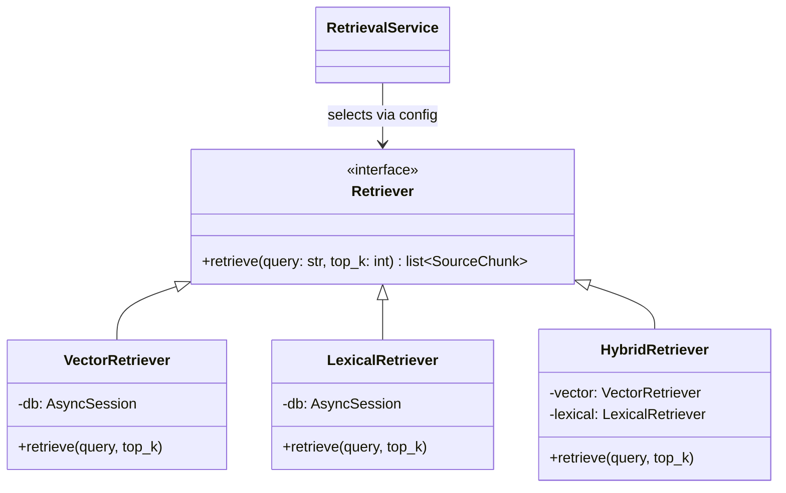
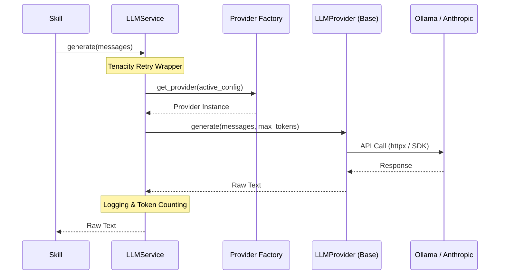
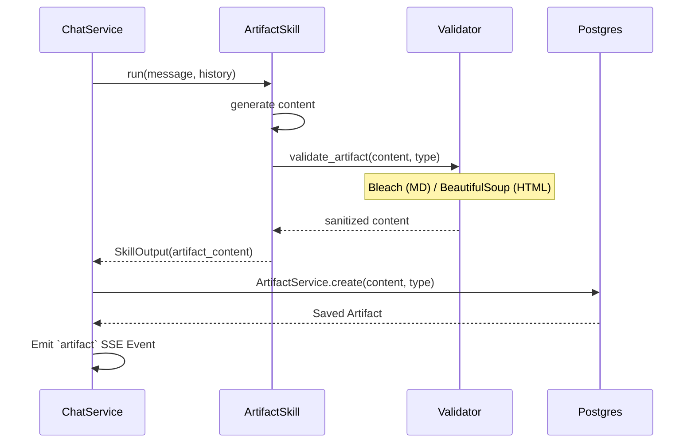

# Architecture Overview

## Data Model & RAG Pipeline

The Lenny Growth Assistant implements an asynchronous Retrieval-Augmented Generation (RAG) pipeline built on PostgreSQL (pgvector). The system ingests podcast transcripts and chunks them by size/overlap, storing both dense vector embeddings (via Ollama or OpenAI) and plain text for lexical indexing.

### Chat Flow Sequence

```mermaid
sequenceDiagram
    participant U as User
    participant A as API Layer
    participant R as Intent Router
    participant S as ChatService
    participant C as ContextBuilder
    participant SK as Selected Skill
    participant P as LLM Provider
    participant DB as Postgres

    U->>A: POST /sessions/{id}/chat (stream=true)
    A->>S: handle_stream(message)
    S->>R: classify(message, history)
    R-->>S: RoutingResult (skill, intent)
    S->>S: load recent history
    S->>SK: run(message, history)
    
    rect rgb(20, 30, 40)
        Note over SK,DB: (If QA or Ship30)
        SK->>DB: retrieve(query)
        DB-->>SK: top_k chunks
        SK->>C: build(history, chunks)
    end
    
    C-->>SK: final prompt payload
    SK->>P: generate_stream(payload)
    P-->>SK: token stream
    SK-->>S: emit tokens + artifacts
    S-->>A: SSE Events (token, artifact)
    A-->>U: streaming display
```

## Retrieval Architecture

We support multiple retrieval modes seamlessly via configuration:

## Provider Abstraction

LLM and Embedding interactions are heavily abstracted so that the core business logic (Skills and Routers) is completely decoupled from SDKs like `anthropic` or `httpx`.

## Artifact Generation Pipeline

The system is capable of producing rich inline documents and UI components on demand. When the `artifact` skill is selected (or when `ship30` finishes its essay), an Artifact record is synthesized.

## Database Schema (pgvector)

The backend uses **SQLAlchemy** connected to PostgreSQL. Below is a high-level overview of the ORM models:

- `Session`: Represents a chat thread.
  - `id` (UUID), `title` (String), `created_at` (DateTime)
  - Tracks `llm_provider` and `embedding_model` used for that specific session.
- `Message`: Represents an individual turn in a session.
  - `id` (UUID), `session_id` (FK), `role` (user|assistant), `content` (Text)
  - Stores metadata: `skill_used`, `routing_intent`, and `sources_json` for debugging/UI.
- `Artifact`: Represents generated documents (Markdown/HTML).
  - `id` (UUID), `message_id` (FK), `type` (markdown|html), `content` (Text), `version` (Int).
- `TranscriptChunk`: Stores ingested podcast segments.
  - `id` (UUID), `episode_title` (String), `chunk_text` (Text), `embedding` (Vector: 768 dims), `source_url`.

## API Endpoints (`/api/v1`)

The FastAPI application follows a RESTful pattern with SSE for real-time streaming:
- **Sessions**:
  - `GET /sessions`: List all sessions
  - `POST /sessions`: Create a new session
  - `GET /sessions/{id}`: Load a session and its message history
  - `DELETE /sessions/{id}`: Delete a session
- **Chat**:
  - `POST /sessions/{id}/chat`: Primary endpoint. Accepts `{message: str, stream: bool}`. Returns a Server-Sent Events (SSE) stream containing token chunks, retrieved sources, routing decisions, and artifact events.
- **Artifacts**:
  - `GET /artifacts/{id}`: Retrieve a specific artifact document by ID.
- **Ingestion**:
  - `POST /ingest`: Trigger the background task to clone the GitHub repo, chunk Markdown files, and embed them.
- **Config & Health**:
  - `GET /config/providers`: Exposes current active LLM/Embedding config to the UI.
  - `GET /health`: Standard health check.

## Agentic Routing Logic

The system uses a **Two-Pass Intent Router**:
1. **Deterministic Pass**: O(1) keyword and regex matching (e.g., `\bgenerate an artifact\b`) to quickly catch explicit user commands.
2. **LLM Fallback Pass**: If deterministic fails, the message and recent context are sent to a fast LLM classifier which outputs JSON.

**Available Agent Skills**:
- `qa`: Triggered for domain-specific product/growth questions. Requires vector retrieval.
- `chat`: Triggered for generic chit-chat, greetings, and meta-questions about the conversation history. **Bypasses vector retrieval entirely** to prevent context contamination (RLHF hallucination).
- `artifact`: Triggered for explicit requests to build documents, dashboards, or UI components.
- `ship30`: Triggered for converting insights into Twitter/LinkedIn essays.

## LLM Toggle Switch Implementation

The system supports hot-swapping between Local (Ollama) and Cloud (Anthropic/OpenAI) models seamlessly via the **Provider Factory Pattern**.

1. Configuration is managed in `.env` (`ACTIVE_LLM_PROVIDER="ollama"` or `"anthropic"`).
2. The `LLMService` is completely decoupled from the underlying SDK. When a Skill calls `_llm.generate()`, the `LLMService` dynamically requests a concrete provider instance from the `ProviderFactory`.
3. The `ProviderFactory` inspects the active config and returns either an `OllamaProvider` (using HTTPX) or an `AnthropicProvider` (using the official SDK).
4. Both providers implement the abstract `LLMProvider` interface (`generate` and `generate_stream`), normalizing the payloads (handling system prompts, message history arrays) so the core Agent logic never knows which model is actively serving the tokens.
