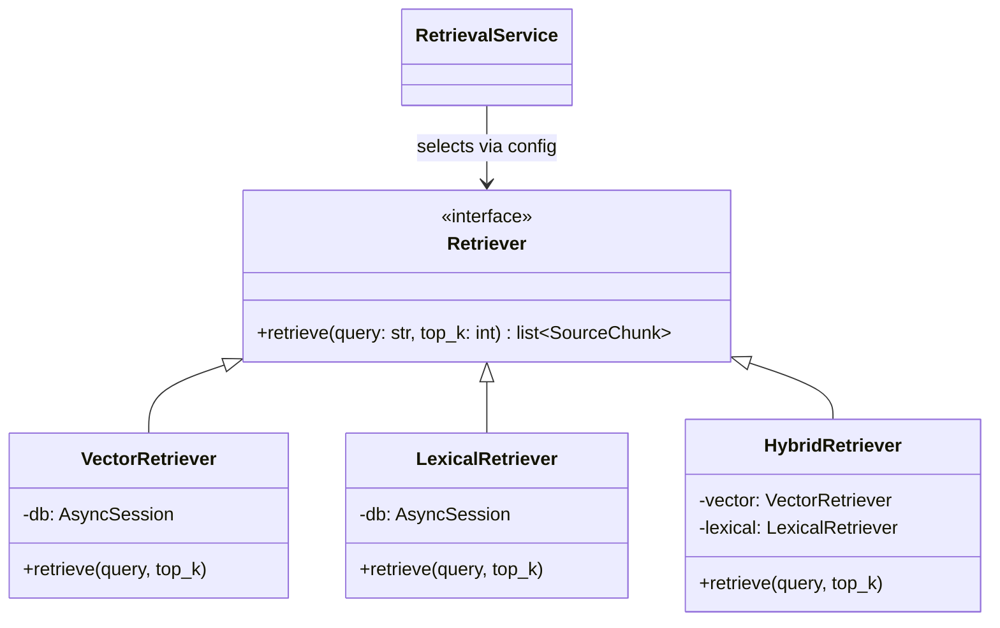
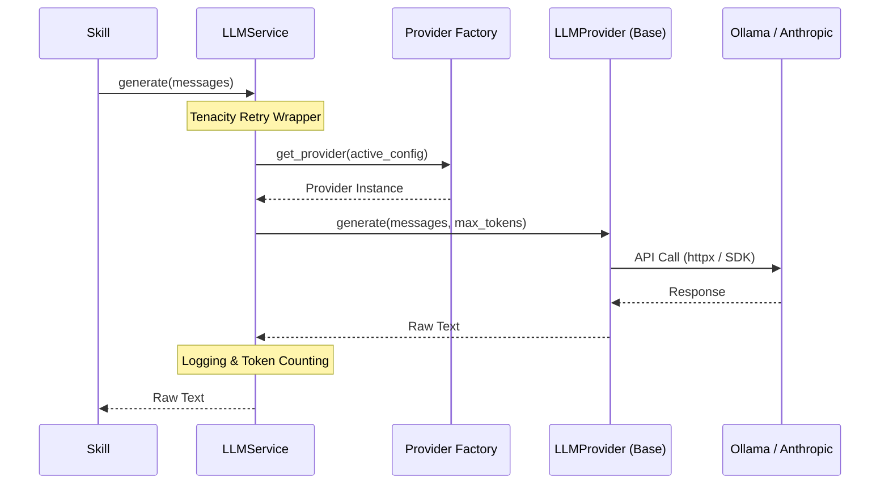
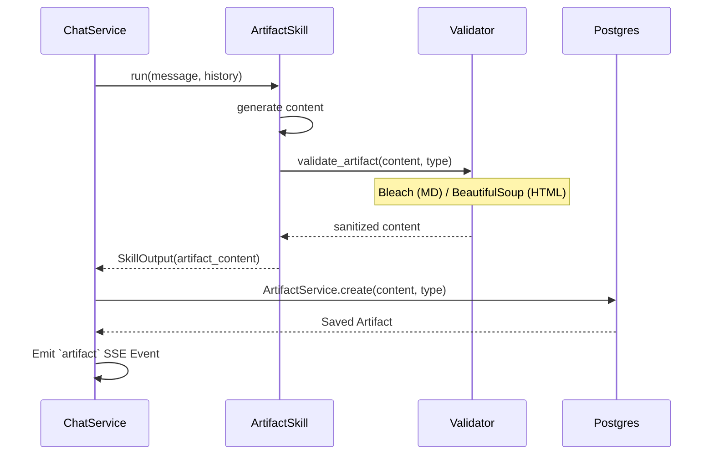

# Architecture Overview

## Data Model & RAG Pipeline

The Lenny Growth Assistant implements an asynchronous Retrieval-Augmented Generation (RAG) pipeline built on PostgreSQL (pgvector). The system ingests podcast transcripts and chunks them by size/overlap, storing both dense vector embeddings (via Ollama or OpenAI) and plain text for lexical indexing.

### Chat Flow Sequence

```mermaid
sequenceDiagram
    participant U as User
    participant A as API Layer
    participant R as Intent Router
    participant S as ChatService
    participant C as ContextBuilder
    participant SK as Selected Skill
    participant P as LLM Provider
    participant DB as Postgres

    U->>A: POST /sessions/{id}/chat (stream=true)
    A->>S: handle_stream(message)
    S->>R: classify(message, history)
    R-->>S: RoutingResult (skill, intent)
    S->>S: load recent history
    S->>SK: run(message, history)
    
    rect rgb(20, 30, 40)
        Note over SK,DB: (If QA or Ship30)
        SK->>DB: retrieve(query)
        DB-->>SK: top_k chunks
        SK->>C: build(history, chunks)
    end
    
    C-->>SK: final prompt payload
    SK->>P: generate_stream(payload)
    P-->>SK: token stream
    SK-->>S: emit tokens + artifacts
    S-->>A: SSE Events (token, artifact)
    A-->>U: streaming display
```

## Retrieval Architecture

We support multiple retrieval modes seamlessly via configuration:

## Provider Abstraction

LLM and Embedding interactions are heavily abstracted so that the core business logic (Skills and Routers) is completely decoupled from SDKs like `anthropic` or `httpx`.

## Artifact Generation Pipeline

The system is capable of producing rich inline documents and UI components on demand. When the `artifact` skill is selected (or when `ship30` finishes its essay), an Artifact record is synthesized.

